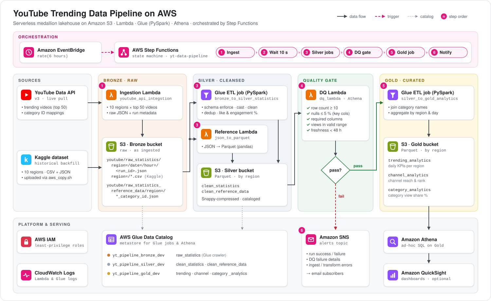
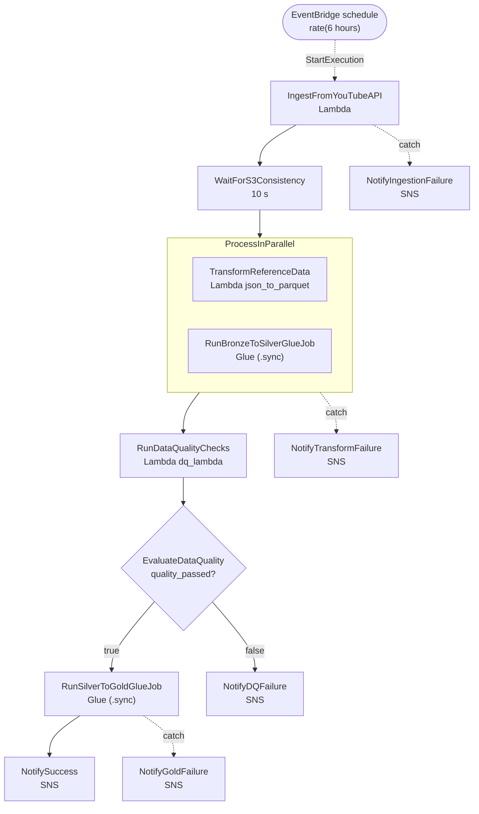

# YouTube Trending Data Pipeline on AWS


An event-driven, serverless ETL pipeline that collects **YouTube trending-video data for 10 countries**, refines it through a **medallion lakehouse on Amazon S3** (Bronze → Silver → Gold), blocks bad data with an automated **data-quality gate**, and publishes analytics-ready tables you can query with **Amazon Athena**. The whole run is orchestrated by **AWS Step Functions** with retries, parallel branches and SNS alerting.



---

## Table of Contents

- [Highlights](#highlights)
- [Architecture](#architecture)
  - [Lakehouse layers](#lakehouse-layers)
  - [Orchestration](#orchestration)
- [Tech Stack](#tech-stack)
- [Repository Structure](#repository-structure)
- [How the Data Flows](#how-the-data-flows)
- [Data Model](#data-model)
- [Getting Started](#getting-started)
- [Running the Pipeline](#running-the-pipeline)
- [Querying with Athena](#querying-with-athena)
- [Monitoring & Alerting](#monitoring--alerting)
- [Configuration Reference](#configuration-reference)
- [Cost & Performance Notes](#cost--performance-notes)
- [Known Limitations & Roadmap](#known-limitations--roadmap)
- [Data Sources](#data-sources)

---

## Highlights

- **Live ingestion and historical backfill.** A Lambda pulls the top 50 trending videos and the category mappings for each region from the YouTube Data API v3. Historical Kaggle CSVs can be loaded into the same Bronze zone.
- **Medallion architecture.** Raw data is kept unchanged in Bronze. Silver holds cleansed, typed and de-duplicated Parquet, and Gold holds business aggregates.
- **Schema-tolerant PySpark.** One Glue job maps both the API JSON and the Kaggle CSV shapes onto a single 17-column schema and adds engagement metrics.
- **Data-quality gate.** Row-count, null, schema, value-range and freshness checks must all pass before Gold is rebuilt. If any check fails, the details go to SNS.
- **Resilient orchestration.** Step Functions runs the steps with per-step retries and exponential backoff, runs the two Silver transforms in parallel, and sends an SNS alert at every failure point.
- **Query-ready output.** Every layer is registered in the Glue Data Catalog. Gold is partitioned by region, so Athena and QuickSight can query it without scanning everything.

---

## Architecture

### Lakehouse layers

| Layer | S3 location | Format | Written by | Glue Catalog |
|---|---|---|---|---|
| **Bronze** (raw) | `s3://<bronze>/youtube/raw_statistics/`<br>`s3://<bronze>/youtube/raw_statistics_reference_data/` | JSON (API), CSV (Kaggle) | Ingestion Lambda, `aws_copy.sh` | `yt_pipeline_bronze_<env>.raw_statistics` (via crawler) |
| **Silver** (cleansed) | `s3://<silver>/youtube/statistics/`<br>`s3://<silver>/youtube/reference_data/` | Parquet + Snappy, partitioned by `region` | Glue `bronze_to_silver_statistics`, Lambda `json_to_parquet` | `clean_statistics`, `clean_reference_data` |
| **Gold** (curated) | `s3://<gold>/youtube/{trending,channel,category}_analytics/` | Parquet + Snappy, partitioned by `region` | Glue `silver_to_gold_analytics` | `trending_analytics`, `channel_analytics`, `category_analytics` |

### Orchestration

The state machine in [`step_functions/pipeline_orchestation.json`](step_functions/pipeline_orchestation.json) runs these states:



| State | Type | Retry policy | On error |
|---|---|---|---|
| `IngestFromYouTubeAPI` | Lambda task | 3 attempts, 30 s, ×2 backoff (Lambda service / throttling errors) | `NotifyIngestionFailure` |
| `WaitForS3Consistency` | Wait (10 s) | — | — |
| `ProcessInParallel` → `TransformReferenceData` | Lambda task | 2 attempts, 15 s, ×2 backoff | `NotifyTransformFailure` |
| `ProcessInParallel` → `RunBronzeToSilverGlueJob` | Glue `startJobRun.sync` | 2 attempts, 60 s, ×2 backoff | `NotifyTransformFailure` |
| `RunDataQualityChecks` | Lambda task | 2 attempts, 15 s, ×2 backoff | — |
| `EvaluateDataQuality` | Choice | — | `NotifyDQFailure` when `quality_passed` is `false` |
| `RunSilverToGoldGlueJob` | Glue `startJobRun.sync` | 2 attempts, 60 s, ×2 backoff | `NotifyGoldFailure` |
| `NotifySuccess` | SNS publish | — | — |

---

## Tech Stack

| Concern | Service / Library |
|---|---|
| Ingestion & lightweight transforms | AWS Lambda (Python, `urllib`, Boto3, AWS SDK for pandas / `awswrangler`) |
| Distributed transforms | AWS Glue 4.0 (PySpark, DynamicFrames) |
| Storage | Amazon S3 (Parquet + Snappy, Hive-style partitions) |
| Metadata | AWS Glue Data Catalog + Glue Crawler |
| Orchestration & scheduling | AWS Step Functions, Amazon EventBridge |
| Data quality | Lambda + Amazon Athena |
| Query & BI | Amazon Athena, Amazon QuickSight (optional) |
| Alerting & logs | Amazon SNS, Amazon CloudWatch Logs |
| Security | AWS IAM (one role per service) |

---

## Repository Structure

```
.
├── data/
│   ├── {RG}_category_id.json             # Category ID → name mappings (10 regions)
│   └── {RG}videos.csv                    # Kaggle trending videos (git-ignored, see Data Sources)
├── data_quality/
│   └── dq_lambda.py                      # Lambda: Silver data-quality gate (queries Athena)
├── docs/
│   └── architecture.svg                  # Architecture diagram
├── glue_jobs/
│   ├── bronze_to_silver_statistics.py    # Glue PySpark: Bronze → Silver (cleanse, dedup, metrics)
│   └── silver_to_gold_analytics.py       # Glue PySpark: Silver → Gold (3 aggregate tables)
├── iam_permission/
│   ├── yt-data-pipeline-glue-access.json    # Inline policy for the Glue role
│   ├── yt-data-pipeline-lambda-access.json  # Inline policy for the Lambda role
│   └── yt-data-pipeline-sfn-access.json     # Inline policy for the Step Functions role
├── lambdas/
│   ├── json_to_parquet/
│   │   └── lambda_function.py            # Lambda: reference JSON → Silver Parquet
│   └── youtube_api_integstion/
│       └── lambda_function.py            # Lambda: YouTube Data API → Bronze
├── scripts/
│   ├── aws_copy.sh                       # Uploads Kaggle files to the Bronze bucket
│   └── information.md                    # Resource names from the reference deployment
├── step_functions/
│   └── pipeline_orchestation.json        # State machine definition (Amazon States Language)
└── README.md
```

---

## How the Data Flows

### 1 · Ingestion → Bronze

[`lambdas/youtube_api_integstion/lambda_function.py`](lambdas/youtube_api_integstion/lambda_function.py)

For every region in `YOUTUBE_REGIONS`, the Lambda:

1. Calls `videos.list?chart=mostPopular` (top 50, with `snippet`, `statistics` and `contentDetails`) and `videoCategories.list`.
2. Adds a `_pipeline_metadata` block (ingestion ID, region, timestamp, video count, source).
3. Writes the raw response to S3 with Hive-style partitions. Region codes are lower-cased:

```
s3://<bronze>/youtube/raw_statistics/region=us/date=2026-10-09/hour=06/20261009_060000.json
s3://<bronze>/youtube/raw_statistics_reference_data/region=us/date=2026-10-09/us_category_id.json
```

A failure in one region doesn't stop the run. The other regions continue, and a summary of the failures is published to SNS.

For **historical backfill**, [`scripts/aws_copy.sh`](scripts/aws_copy.sh) uploads the Kaggle `{RG}videos.csv` and `{RG}_category_id.json` files to the same prefixes under `region=<rg>/`.

### 2 · Bronze → Silver

**Statistics** are processed by the Glue job [`glue_jobs/bronze_to_silver_statistics.py`](glue_jobs/bronze_to_silver_statistics.py):

| Step | What happens |
|---|---|
| Read | Reads the Bronze catalog table, with a push-down predicate on `region` |
| Schema enforcement | Detects whether the input is the flattened API format or the Kaggle CSV format, then maps it to one typed schema (counts → `long`, flags → `boolean`) |
| Cleansing | Drops rows without a `video_id`, lower-cases and trims `region`, parses `trending_date` (Kaggle `yy.dd.MM`) into `trending_date_parsed`, and sets null counts to `0` |
| Derived metrics | `like_ratio = likes / views × 100`<br>`engagement_rate = (likes + dislikes + comment_count) / views × 100` |
| De-duplication | Keeps the latest record per `(video_id, region, trending_date_parsed)` |
| In-job checks | Logs null counts on key columns and any negative view counts |
| Write | Parquet + Snappy to `s3://<silver>/youtube/statistics/`, partitioned by `region`. Updates the `clean_statistics` table in the catalog |

**Reference data** is processed by the Lambda [`lambdas/json_to_parquet/lambda_function.py`](lambdas/json_to_parquet/lambda_function.py):

- It runs on an **S3 `ObjectCreated` event** for the reference-data prefix.
- It reads the JSON with Boto3 rather than `wr.s3.read_json`, because the file mixes scalar fields with a nested `items[]` array, which pandas can't load directly. It then flattens `items[]` with `pd.json_normalize`.
- It validates the rows, de-duplicates on category `id`, and adds `_ingestion_timestamp`, `_source_file` and `region` columns.
- It writes with `awswrangler` using `mode="overwrite_partitions"`, so re-running a region gives the same result. It also registers the `clean_reference_data` table.

### 3 · Data-quality gate

[`data_quality/dq_lambda.py`](data_quality/dq_lambda.py) samples up to 10,000 rows from each Silver table through Athena and runs these checks:

| Check | Rule | Tables |
|---|---|---|
| Row count | `≥ DQ_MIN_ROW_COUNT` (default **10**) | all |
| Null percentage | `≤ DQ_MAX_NULL_PERCENT` (default **5 %**) on critical columns | `clean_statistics`: `video_id`, `title`, `channel_title`, `views`, `region`<br>`clean_reference_data`: `id`, `region` |
| Schema | All critical columns are present | all |
| Value range | `0 ≤ views ≤ 50,000,000,000` | `clean_statistics` |
| Freshness | Latest `_processed_at` / `_ingestion_timestamp` is less than **48 h** old (skipped if the table has no timestamp column) | all |

The Lambda returns `{quality_passed, checks_passed, checks_total, details}`. The `EvaluateDataQuality` Choice state moves on to Gold **only** when `quality_passed` is `true`. Otherwise, the failed checks go to SNS and the run stops.

### 4 · Silver → Gold

[`glue_jobs/silver_to_gold_analytics.py`](glue_jobs/silver_to_gold_analytics.py) reads `clean_statistics` and joins it with `clean_reference_data` using a broadcast join to add category names. If the reference data is missing, the category name falls back to `Unknown`. The job then writes three Gold tables (see [Data Model](#data-model)).

---

## Data Model

<details>
<summary><b>Silver · <code>clean_statistics</code></b></summary>

| Column | Type | Notes |
|---|---|---|
| `video_id` | string | YouTube video ID |
| `trending_date` | string | Raw trending date (Kaggle `yy.dd.MM`) |
| `trending_date_parsed` | date | Parsed trending date |
| `title`, `channel_title`, `description`, `tags` | string | Video metadata |
| `category_id` | bigint | Joins to `clean_reference_data.id` |
| `publish_time` | string | Original publish timestamp |
| `views`, `likes`, `dislikes`, `comment_count` | bigint | Nulls set to `0` |
| `thumbnail_link` | string | Default thumbnail URL |
| `comments_disabled`, `ratings_disabled`, `video_error_or_removed` | boolean | Kaggle flags (`false` for API data) |
| `like_ratio` | double | `likes / views × 100` |
| `engagement_rate` | double | `(likes + dislikes + comments) / views × 100` |
| `_processed_at`, `_job_name` | timestamp, string | Lineage metadata |
| `region` | string | **Partition key** (lower-case) |

</details>

<details>
<summary><b>Gold · <code>trending_analytics</code></b>: daily KPIs per region</summary>

| Column | Description |
|---|---|
| `region` | Partition key |
| `trending_date_parsed` | Snapshot date |
| `total_videos` | Trending videos that day |
| `total_views`, `total_likes`, `total_dislikes`, `total_comments` | Sums |
| `avg_views_per_video`, `max_views` | View distribution |
| `avg_like_ratio`, `avg_engagement_rate` | Engagement |
| `unique_channels`, `unique_categories` | Diversity |
| `_aggregated_at` | Build timestamp |

</details>

<details>
<summary><b>Gold · <code>channel_analytics</code></b>: channel performance and ranking</summary>

| Column | Description |
|---|---|
| `channel_title`, `region` | Grain (one row per channel per region) |
| `total_videos` | Distinct videos that trended |
| `total_views`, `total_likes`, `total_comments` | Sums |
| `avg_views_per_video`, `avg_engagement_rate`, `peak_views` | Performance |
| `times_trending`, `first_trending`, `last_trending` | Trending history |
| `categories` | `array<string>` of category names |
| `rank_in_region` | Rank by `total_views` within the region |
| `_aggregated_at` | Build timestamp |

</details>

<details>
<summary><b>Gold · <code>category_analytics</code></b>: category trends and view share</summary>

| Column | Description |
|---|---|
| `category_name`, `category_id`, `region`, `trending_date_parsed` | Grain |
| `video_count`, `unique_channels` | Volume |
| `total_views`, `total_likes`, `total_comments` | Sums |
| `avg_engagement_rate` | Engagement |
| `view_share_pct` | Category share of the region's views that day |
| `_aggregated_at` | Build timestamp |

</details>

---

## Getting Started

### Prerequisites

- An AWS account with permission to create S3, Lambda, Glue, Step Functions, SNS, IAM, Athena, EventBridge and CloudWatch resources
- [AWS CLI v2](https://docs.aws.amazon.com/cli/latest/userguide/getting-started-install.html), configured with `aws configure`
- A **YouTube Data API v3 key** from the [Google Cloud Console](https://console.cloud.google.com/apis/credentials)
- Python 3.10+ (only needed for local tooling)
- *(Optional)* the [Kaggle CLI](https://github.com/Kaggle/kaggle-api), for downloading historical data

### 1. Clone the repo and set shell variables

```bash
git clone https://github.com/niluthpalchowdhury/Youtube-Data-Pipeline-AWS.git
cd Youtube-Data-Pipeline-AWS

export AWS_REGION=ap-south-1
export ENV=dev
export ACCOUNT_ID=$(aws sts get-caller-identity --query Account --output text)

export BRONZE=yt-data-pipeline-bronze-$AWS_REGION-$ENV
export SILVER=yt-data-pipeline-silver-$AWS_REGION-$ENV
export GOLD=yt-data-pipeline-gold-$AWS_REGION-$ENV
export SCRIPTS=yt-data-pipeline-script-$AWS_REGION-$ENV
mkdir -p build
```

All the commands below use these variables.

### 2. Storage, catalog and alerts

```bash
# S3 buckets
for b in $BRONZE $SILVER $GOLD $SCRIPTS; do aws s3 mb s3://$b --region $AWS_REGION; done

# Glue databases
for layer in bronze silver gold; do
  aws glue create-database --database-input "{\"Name\":\"yt_pipeline_${layer}_${ENV}\"}"
done

# SNS topic + email subscription (confirm the email you receive)
export SNS_TOPIC_ARN=$(aws sns create-topic --name yt-data-pipeline-alerts-$ENV --query TopicArn --output text)
aws sns subscribe --topic-arn $SNS_TOPIC_ARN --protocol email --notification-endpoint you@example.com
```

> The DQ Lambda queries Athena. Make sure your Athena workgroup has a **query result location**, and that the Lambda role can read and write that S3 path.

### 3. IAM roles

Create one role per service. Attach the AWS managed policy listed below, plus the inline policy from [`iam_permission/`](iam_permission/). **Before you attach an inline policy, change its region, account ID and bucket names to match your environment.**

| Role | Trusted principal | Managed policy | Inline policy |
|---|---|---|---|
| `yt-data-pipeline-lambda-role-<env>` | `lambda.amazonaws.com` | `service-role/AWSLambdaBasicExecutionRole` | `yt-data-pipeline-lambda-access.json` |
| `yt-data-pipeline-glue-role-<env>` | `glue.amazonaws.com` | `service-role/AWSGlueServiceRole` | `yt-data-pipeline-glue-access.json` |
| `yt-data-pipeline-sfn-role-<env>` | `states.amazonaws.com` | — | `yt-data-pipeline-sfn-access.json` |
| `yt-data-pipeline-events-role-<env>` | `events.amazonaws.com` | — | `states:StartExecution` on the state machine |

Here is the Lambda role as an example. The other roles follow the same pattern.

```bash
aws iam create-role --role-name yt-data-pipeline-lambda-role-$ENV \
  --assume-role-policy-document '{"Version":"2012-10-17","Statement":[{"Effect":"Allow","Principal":{"Service":"lambda.amazonaws.com"},"Action":"sts:AssumeRole"}]}'
aws iam attach-role-policy --role-name yt-data-pipeline-lambda-role-$ENV \
  --policy-arn arn:aws:iam::aws:policy/service-role/AWSLambdaBasicExecutionRole
aws iam put-role-policy --role-name yt-data-pipeline-lambda-role-$ENV \
  --policy-name yt-data-pipeline-lambda-access \
  --policy-document file://iam_permission/yt-data-pipeline-lambda-access.json
```

### 4. Lambda functions

| Function | Source | Handler | Layer | Timeout / Memory |
|---|---|---|---|---|
| `yt-data-pipeline-youtube-ingestion-<env>` | `lambdas/youtube_api_integstion/lambda_function.py` | `lambda_function.lambda_handler` | — (stdlib + Boto3) | 300 s / 256 MB |
| `yt-data-pipeline-json-to-parquet-<env>` | `lambdas/json_to_parquet/lambda_function.py` | `lambda_function.lambda_handler` | AWS SDK for pandas | 120 s / 512 MB |
| `yt-data-pipeline-data-quality-<env>` | `data_quality/dq_lambda.py` | `dq_lambda.lambda_handler` | AWS SDK for pandas | 300 s / 512 MB |

```bash
LAMBDA_ROLE=arn:aws:iam::$ACCOUNT_ID:role/yt-data-pipeline-lambda-role-$ENV
# Managed layer ARN for your region & runtime: https://aws-sdk-pandas.readthedocs.io/en/stable/layers.html
PANDAS_LAYER=arn:aws:lambda:$AWS_REGION:336392948345:layer:AWSSDKPandas-Python312:<version>

zip -j build/ingestion.zip lambdas/youtube_api_integstion/lambda_function.py
aws lambda create-function --function-name yt-data-pipeline-youtube-ingestion-$ENV \
  --runtime python3.12 --handler lambda_function.lambda_handler --role $LAMBDA_ROLE \
  --zip-file fileb://build/ingestion.zip --timeout 300 --memory-size 256 \
  --environment "Variables={YOUTUBE_API_KEY=<your-api-key>,S3_BUCKET_BRONZE=$BRONZE,SNS_ALERT_TOPIC_ARN=$SNS_TOPIC_ARN}"

zip -j build/json_to_parquet.zip lambdas/json_to_parquet/lambda_function.py
aws lambda create-function --function-name yt-data-pipeline-json-to-parquet-$ENV \
  --runtime python3.12 --handler lambda_function.lambda_handler --role $LAMBDA_ROLE \
  --zip-file fileb://build/json_to_parquet.zip --timeout 120 --memory-size 512 --layers $PANDAS_LAYER \
  --environment "Variables={S3_BUCKET_SILVER=$SILVER,GLUE_DB_SILVER=yt_pipeline_silver_$ENV,SNS_ALERT_TOPIC_ARN=$SNS_TOPIC_ARN}"

zip -j build/dq.zip data_quality/dq_lambda.py
aws lambda create-function --function-name yt-data-pipeline-data-quality-$ENV \
  --runtime python3.12 --handler dq_lambda.lambda_handler --role $LAMBDA_ROLE \
  --zip-file fileb://build/dq.zip --timeout 300 --memory-size 512 --layers $PANDAS_LAYER \
  --environment "Variables={SNS_ALERT_TOPIC_ARN=$SNS_TOPIC_ARN}"
```

Next, connect the reference-data Lambda to new category files in Bronze:

```bash
aws lambda add-permission --function-name yt-data-pipeline-json-to-parquet-$ENV \
  --statement-id s3-invoke --action lambda:InvokeFunction --principal s3.amazonaws.com \
  --source-arn arn:aws:s3:::$BRONZE --source-account $ACCOUNT_ID

cat > build/s3-notification.json <<EOF
{"LambdaFunctionConfigurations":[{
  "LambdaFunctionArn":"arn:aws:lambda:$AWS_REGION:$ACCOUNT_ID:function:yt-data-pipeline-json-to-parquet-$ENV",
  "Events":["s3:ObjectCreated:*"],
  "Filter":{"Key":{"FilterRules":[
    {"Name":"prefix","Value":"youtube/raw_statistics_reference_data/"},
    {"Name":"suffix","Value":".json"}]}}}]}
EOF
aws s3api put-bucket-notification-configuration --bucket $BRONZE \
  --notification-configuration file://build/s3-notification.json
```

> 🔐 Never commit your YouTube API key. For production, keep it in AWS Secrets Manager or SSM Parameter Store.

### 5. Glue crawler and jobs

```bash
GLUE_ROLE=yt-data-pipeline-glue-role-$ENV

# Crawler that registers Bronze statistics as yt_pipeline_bronze_<env>.raw_statistics
aws glue create-crawler --name yt-data-pipeline-bronze-crawler-$ENV --role $GLUE_ROLE \
  --database-name yt_pipeline_bronze_$ENV \
  --targets "{\"S3Targets\":[{\"Path\":\"s3://$BRONZE/youtube/raw_statistics/\"}]}"

# Upload the job scripts
aws s3 cp glue_jobs/ s3://$SCRIPTS/glue_jobs/ --recursive

# Bronze → Silver (bookmarks on, so each run only processes new files)
aws glue create-job --name yt-data-pipeline-bronze-to-silver-$ENV --role $GLUE_ROLE \
  --glue-version 4.0 --worker-type G.1X --number-of-workers 2 \
  --command "Name=glueetl,ScriptLocation=s3://$SCRIPTS/glue_jobs/bronze_to_silver_statistics.py,PythonVersion=3" \
  --default-arguments '{"--job-bookmark-option":"job-bookmark-enable","--enable-continuous-cloudwatch-log":"true"}'

# Silver → Gold
aws glue create-job --name yt-data-pipeline-silver-to-gold-$ENV --role $GLUE_ROLE \
  --glue-version 4.0 --worker-type G.1X --number-of-workers 2 \
  --command "Name=glueetl,ScriptLocation=s3://$SCRIPTS/glue_jobs/silver_to_gold_analytics.py,PythonVersion=3" \
  --default-arguments '{"--enable-continuous-cloudwatch-log":"true"}'
```

### 6. Step Functions state machine

The committed definition contains the account ID and region of the reference deployment, and its SNS `TopicArn` values end in a subscription ID. The command below swaps in your account and region and reduces each ARN to the plain topic ARN, which is what `sns:Publish` needs:

```bash
sed -E -e "s/206986907456/${ACCOUNT_ID}/g" -e "s/ap-south-1/${AWS_REGION}/g" \
  -e 's/(yt-data-pipeline-alerts-[a-z0-9]+):[0-9a-f-]+"/\1"/g' \
  step_functions/pipeline_orchestation.json > build/state_machine.json

aws stepfunctions create-state-machine --name yt-data-pipeline-$ENV \
  --definition file://build/state_machine.json \
  --role-arn arn:aws:iam::$ACCOUNT_ID:role/yt-data-pipeline-sfn-role-$ENV
```

> If you use an `ENV` other than `dev`, also update the `-dev` / `_dev` resource names inside the definition.

### 7. Schedule

```bash
aws events put-rule --name yt-data-pipeline-schedule-$ENV --schedule-expression "rate(6 hours)"
aws events put-targets --rule yt-data-pipeline-schedule-$ENV --targets \
  "Id=1,Arn=arn:aws:states:$AWS_REGION:$ACCOUNT_ID:stateMachine:yt-data-pipeline-$ENV,RoleArn=arn:aws:iam::$ACCOUNT_ID:role/yt-data-pipeline-events-role-$ENV"
```

---

## Running the Pipeline

| Mode | How |
|---|---|
| **Scheduled** | The EventBridge rule starts an execution every 6 hours |
| **On demand** | `aws stepfunctions start-execution --state-machine-arn arn:aws:states:$AWS_REGION:$ACCOUNT_ID:stateMachine:yt-data-pipeline-$ENV` |
| **Historical backfill** | Download the Kaggle data into `data/` (see [Data Sources](#data-sources)), set the bucket name in `scripts/aws_copy.sh`, run `cd data && bash ../scripts/aws_copy.sh`, start the crawler, then trigger the pipeline |
| **Single component** | `aws glue start-job-run --job-name yt-data-pipeline-bronze-to-silver-$ENV --arguments '{"--bronze_database":"yt_pipeline_bronze_dev", ...}'`<br>`aws lambda invoke --function-name yt-data-pipeline-data-quality-$ENV --cli-binary-format raw-in-base64-out --payload '{"database":"yt_pipeline_silver_dev","tables":["clean_statistics"]}' build/dq-out.json` |

**Order of one run:**

```
1. Ingest     YouTube API ─► Bronze (JSON)                     Lambda
2. Wait       10 s
3. Silver     ┌─ Bronze stats ─► clean_statistics            Glue (PySpark)
              └─ reference JSON ─► clean_reference_data      Lambda (pandas)
4. DQ gate    5 checks on Silver via Athena ─► pass / fail    Lambda
5. Gold       trending / channel / category analytics         Glue (PySpark)
6. Notify     success or failure ─► SNS
```

---

## Querying with Athena

Region values are stored in **lower case** (`'us'`, `'gb'`, `'in'`, …).

```sql
-- Top 10 channels by total views in the US
SELECT channel_title, total_views, times_trending, rank_in_region
FROM yt_pipeline_gold_dev.channel_analytics
WHERE region = 'us' AND rank_in_region <= 10
ORDER BY rank_in_region;
```

```sql
-- Category share of views on the most recent day, per region
SELECT region, category_name, view_share_pct
FROM yt_pipeline_gold_dev.category_analytics
WHERE trending_date_parsed = (SELECT max(trending_date_parsed)
                              FROM yt_pipeline_gold_dev.category_analytics)
ORDER BY region, view_share_pct DESC;
```

```sql
-- Daily engagement trend for India
SELECT trending_date_parsed, total_videos, total_views, avg_engagement_rate
FROM yt_pipeline_gold_dev.trending_analytics
WHERE region = 'in'
ORDER BY trending_date_parsed;
```

---

## Monitoring & Alerting

| Where | What you get |
|---|---|
| **Step Functions console** | Visual execution graph, input and output of each state, and the retry history. DQ details are under `$.dq_result.Payload.details` |
| **CloudWatch Logs** | `/aws/lambda/yt-data-pipeline-*` for the Lambdas, and `/aws-glue/jobs/*` for the Glue jobs (continuous logging is enabled) |
| **SNS alerts** | Sent on every failure path, plus one success message per run |

| Alert subject | Sent by |
|---|---|
| `[YT Pipeline] Ingestion partial failure — <id>` | Ingestion Lambda (one or more regions failed) |
| `[YT Pipeline] Silver reference transform failed` | `json_to_parquet` Lambda |
| `[YT Pipeline] Data quality checks FAILED` | DQ Lambda |
| `[YT Pipeline] FAILURE — Ingestion / Transform / Gold …` | State machine `Catch` handlers |
| `[YT Pipeline] WARNING — Data quality checks failed` | State machine `NotifyDQFailure` |
| `[YT Pipeline] Pipeline completed successfully` | State machine `NotifySuccess` |

---

## Configuration Reference

### Lambda environment variables

| Function | Variable | Required | Default | Purpose |
|---|---|---|---|---|
| Ingestion | `YOUTUBE_API_KEY` | ✅ | — | YouTube Data API v3 key |
| Ingestion | `S3_BUCKET_BRONZE` | ✅ | — | Bronze bucket |
| Ingestion | `YOUTUBE_REGIONS` | | `US,GB,CA,DE,FR,IN,JP,KR,MX,RU` | Regions to ingest |
| Ingestion | `SNS_ALERT_TOPIC_ARN` | | — | Alert topic for partial failures |
| `json_to_parquet` | `S3_BUCKET_SILVER` | ✅ | — | Silver bucket |
| `json_to_parquet` | `GLUE_DB_SILVER` | | `yt_pipeline_silver_dev` | Silver catalog database |
| `json_to_parquet` | `GLUE_TABLE_REFERENCE` | | `clean_reference_data` | Reference table name |
| `json_to_parquet` | `SNS_ALERT_TOPIC_ARN` | | — | Alert topic |
| DQ | `DQ_MIN_ROW_COUNT` | | `10` | Minimum rows per table |
| DQ | `DQ_MAX_NULL_PERCENT` | | `5.0` | Maximum null % on critical columns |
| DQ | `SNS_ALERT_TOPIC_ARN` | | — | Alert topic |

The DQ Lambda takes its **database and table list from the invocation payload**, for example `{"database": "yt_pipeline_silver_dev", "tables": ["clean_statistics", "clean_reference_data"]}`.

### Glue job arguments

| Job | Argument | Example |
|---|---|---|
| Bronze → Silver | `--bronze_database` | `yt_pipeline_bronze_dev` |
| | `--bronze_table` | `raw_statistics` |
| | `--silver_bucket` | `yt-data-pipeline-silver-ap-south-1-dev` |
| | `--silver_database` | `yt_pipeline_silver_dev` |
| | `--silver_table` | `clean_statistics` |
| Silver → Gold | `--silver_database` | `yt_pipeline_silver_dev` |
| | `--gold_bucket` | `yt-data-pipeline-gold-ap-south-1-dev` |
| | `--gold_database` | `yt_pipeline_gold_dev` |

### Supported regions

| Code | Country | Code | Country |
|---|---|---|---|
| `us` | United States | `in` | India |
| `gb` | United Kingdom | `jp` | Japan |
| `ca` | Canada | `kr` | South Korea |
| `de` | Germany | `mx` | Mexico |
| `fr` | France | `ru` | Russia |

---

## Cost & Performance Notes

- **API quota.** `videos.list` and `videoCategories.list` cost 1 unit each. With 10 regions × 2 calls × 4 runs a day, the pipeline uses about **80 units a day**, well under the default quota of 10,000 units a day.
- **Glue is the main cost.** Both jobs run on 2 × G.1X workers. Job bookmarks on the Bronze → Silver job keep each run to newly arrived files.
- **Athena cost scales with data scanned.** Every Silver and Gold table is partitioned by `region` and stored as columnar Parquet + Snappy, so filtering on `region` keeps scans small. The DQ Lambda reads at most 10,000 rows per table.

---

## Known Limitations & Roadmap

- **Region filter in Bronze → Silver.** The job's `push_down_predicate` is `region in ('ca','gb','us','in')`. Widen it to process all 10 regions.
- **Reference step in the state machine.** `TransformReferenceData` invokes `json_to_parquet` without an S3 record, so in practice the **S3 event trigger** does the reference processing. *Roadmap:* pass the newly written keys from the ingestion step.
- **Gold writes are append-only.** Re-running Silver → Gold appends duplicate aggregates. *Roadmap:* overwrite partitions or purge the target prefix before writing.
- **Mixed formats in one Bronze prefix.** API JSON and Kaggle CSV share `raw_statistics/`, which can make a crawler split them into separate tables. Consider separate prefixes.
- **Dislikes.** The YouTube API has not returned `dislikeCount` since Dec 2021, so it is `0` for API data and engagement rates aren't strictly comparable with the Kaggle history.
- **DQ step errors.** `RunDataQualityChecks` has no `Catch`. A Lambda *error*, as opposed to failed checks, ends the execution without an SNS alert.
- **Next steps:** infrastructure as code (Terraform, AWS CDK or SAM), CI with linting and unit tests for the transforms, and moving the API key to Secrets Manager.

---

## Data Sources

| Source | Use | Link |
|---|---|---|
| YouTube Data API v3 | Live trending videos and category mappings | [videos.list](https://developers.google.com/youtube/v3/docs/videos/list) · [videoCategories.list](https://developers.google.com/youtube/v3/docs/videoCategories/list) |
| Kaggle: *Trending YouTube Video Statistics* | Historical backfill and testing | [datasnaek/youtube-new](https://www.kaggle.com/datasets/datasnaek/youtube-new) |

The Kaggle `*videos.csv` files (~500 MB in total) are **not committed** to this repo. To download them into `data/`:

```bash
kaggle datasets download -d datasnaek/youtube-new -p data --unzip
```

---
